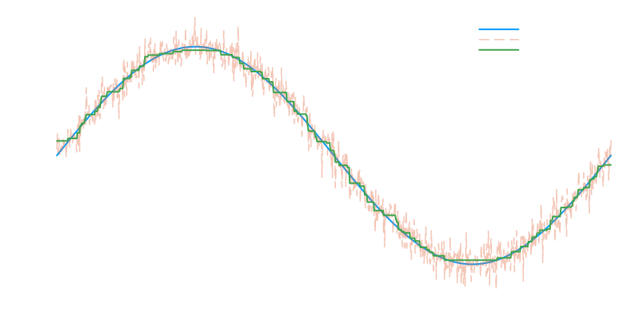

# ProxTV

[](https://nathanemac.github.io/ProxTV.jl)
[](https://github.com/nathanemac/ProxTV.jl/actions)
[](https://github.com/nathanemac/ProxTV.jl/actions/workflows/Test.yml?query=branch%3Amain)
[](https://github.com/nathanemac/ProxTV.jl/actions/workflows/Lint.yml?query=branch%3Amain)
[](https://github.com/nathanemac/ProxTV.jl/actions/workflows/Docs.yml?query=branch%3Amain)

[](https://codecov.io/gh/nathanemac/ProxTV.jl)
[](https://doi.org/FIXME)

[](#contributors)

ProxTV.jl is a Julia package that provides a collection of exact and inexact proximal operators. This includes the Total Variation (TV) regularization with any p-norm.

This package is a Julia implementation of the ProxTV package for MATLAB and Python which is available [here](https://github.com/albarji/proxTV). Behind those implementations, there is a C++ library that provides the core of the proximal operators.

## How to Use

The package is designed to be easy to use and to provide a consistent interface for all the implemented proximal operators.

### Installation

You can install ProxTV.jl using the Julia package manager. From the Julia REPL, type `]` to enter the Pkg REPL mode and run:

```julia
pkg> add ProxTV
```

### Example

Here is an example of how to use ProxTV.jl to compute the proximal operator of the Total Variation (TV) regularization with a p-norm on a 1D signal.

```julia
using ProxTV

n = 1000
x = range(0, 2π; length=n)
true_signal = sin.(x)
noisy_signal = true_signal + 0.1 * randn(n)
recovered_signal = similar(noisy_signal) # output buffer

h = NormTVp(1.0, 1.0, n)
prox!(recovered_signal, h, noisy_signal, 1.0)

```



Comprehensive documentation and more examples can be found in the [online documentation](https://nathanemac.github.io/ProxTV.jl).

## Features

- Fast computation of Lp-norm and Total Variation proximal operators
- Support for 1D, 2D, and nD signals
- Support for any p-norm (L1, L2, and custom p-norms) with p ≥ 1
- Weighted regularization
- many variants (`libproxtv.jl`)
- **Integration with [ShiftedProximalOperators.jl](https://github.com/JuliaSmoothOptimizers/ShiftedProximalOperators.jl) for [RegularizedOptimization.jl](https://github.com/JuliaSmoothOptimizers/RegularizedOptimization.jl)**

## Tests

ProxTV.jl includes comprehensive tests for:

- Core Lp-norm and TV functions
- Integration with ShiftedProximalOperators

## How to Cite

If you use ProxTV.jl in your work, please cite using the reference given in [CITATION.cff](https://github.com/nathanemac/ProxTV.jl/blob/main/CITATION.cff).

## Contributing

If you want to make contributions of any kind, please first that a look into our [contributing guide directly on GitHub](docs/src/90-contributing.md).

---

## Contributors
